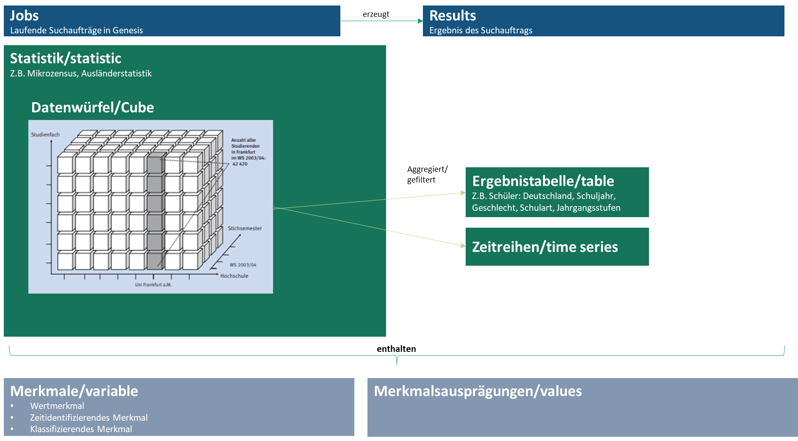

# ``pystatis``

[](https://codecov.io/github/CorrelAid/pystatis)


[](https://github.com/CorrelAid/pystatis/actions/workflows/release-to-pypi.yaml)

``pystatis`` is a Python wrapper for the different GENESIS web service interfaces (API). Currently we are supporting the following databases:

- [GENESIS-Online](https://www-genesis.destatis.de/genesis/online)
- [Regionaldatenbank](https://www.regionalstatistik.de/genesis/online)
- [Zensus Datenbank](https://ergebnisse.zensus2022.de/datenbank/online/)

The main features are:

- **Simplified access** to all supported API. No more need to write cumbersome API calls or switch between databases.
- **Credential management** removes the need to manually add credentials. We handle all your credentials for you.
- **Database management** handles different databases and lets you switch easily between them.
- **Integrated workflow** enables an end-to-end process from finding the relevant data to downloading it.
- **Pandas support** instead of manually parsing results.
- **Caching** to enable productive work despite strict query limits.
- **Starting and handling background jobs** for datasets that are too big to be downloaded directly from GENESIS.

To learn more about GENESIS, please refer to the official documentation [here](https://www.destatis.de/EN/Service/OpenData/api-webservice.html).

The full documentation of the main and dev branches are hosted via [GitHub Pages (main)](https://correlaid.github.io/pystatis/) and [GitHub Pages (dev)](https://correlaid.github.io/pystatis/dev/).

## Zensus 2022 update

The new Zensus has finally arrived and been published. However, old credentials are no longer valid and the base url has changed, too. If you have worked with `pystatis` and Zensus database before, you need to update your config. You can do so in two ways:

**Create a new config**:

1. Delete your current user config manually or via `pystatis.config.delete_config()`.
2. Restart your Python session and import `pystatis` again, this will create a new default config.
3. Set up your credentials via `pystatis.setup_credentials()`.

**Update your config**:

1. It is not enough to just change your credentials, you also have to change the base_url.
2. That is why you have to manually open the current `config.ini` and change both username and password as well as the base_url for the Zensus database.

You can test your changes by calling `pystatis.logincheck("zensus")`.

### API Token

Zensus database now also supports authentication with an API token instead of the classic username and password.
You can get your token from the Webservice interface [info page](https://ergebnisse.zensus2022.de/datenbank/online/statistic/1000A/details#modal=web-service-api) when being logged in.
You can use the token instead of your username, and leave the password blank. There is no extra field or parameter for the token, so you have to pass it as your username. That means `pystatis` is already supporting it, you can just put it as your username and leave the password blank.

## Installation

You can install the package via

```bash
pip install pystatis
```

If everything worked out correctly, you should be able to import `pystatis` like this

```python
import pystatis

print("Version: ", pystatis.__version__)
```

## Getting started

To be able to use the web service/API of either GENESIS-Online, Regionaldatenbank or Zensus, you have to be a registered user of the respective database. You can create your user [here](https://www-genesis.destatis.de/genesis/online?Menu=Anmeldung), [here](https://www.regionalstatistik.de/genesis/online?Menu=Registrierung#abreadcrumb), or [here](https://ergebnisse.zensus2022.de/datenbank/online#modal=login:~:text=hier-,registrieren,-.).

Once you have a registered user, you can use your username and password as credentials for authentication against the web service/API.

You can use `pystatis` with only one of the supported database or with all, it is simply about providing the right credentials. `pystatis` will only use databases for which you have provided credentials.

Please follow this [guide](https://github.com/CorrelAid/pystatis/blob/main/nb/00_Setup.ipynb) to set up `pystatis` correctly.

All APIs provide a `helloworld` endpoint that can be used to check your credentials.

```python
from pystatis.helloworld import logincheck

logincheck("genesis")
```

If everything worked out, your setup is complete and you can start downloading data.

For more details, please study the provided examples [notebooks](https://github.com/CorrelAid/pystatis/tree/main/nb).

## How to use

### The GENESIS data model

The Genesis data structure consists of multiple elements as summarized in the image below.


This package currently supports retrieving the following data types:

- Tables: Main statistical objects provided by the Genesis databases.

### Find the right data

`pystatis` offers the `Find` class to search for any piece of information within each database. Behind the scene it's using the `find` endpoint.

Example:

```python
from pystatis import Find

results = Find("Rohöl", "genesis") # Initiates object that contains all variables, statistics, tables and cubes
results.run() # Runs the query
results.tables.df # Results for tables
results.tables.get_code([1,2,3]) # Gets the table codes, e.g. for downloading the table
results.tables.get_metadata([1,2]) # Gets the metadata for the table
```

A complete overview of all use cases is provided in the example notebook for [find](https://github.com/CorrelAid/pystatis/blob/main/nb/03_find.ipynb).

### Download data

At the moment, the package only supports the download of Tables.

Example for downloading a Table:

```python
from pystatis import Table

t = Table(name="21311-0001")  # data is not yet downloaded
t.get_data()  # only now the data is either fetched from GENESIS or loaded from cache. If the data is downloaded from online, it will be also cached, so next time the data is loaded from cache. The default language of the data is German but it can be set to either German (de) or English (en) using the language parameter of get_data().
t.data  # prettified data stored as pandas DataFrame
```

For more details, please study the provided sample notebook for [tables](https://github.com/CorrelAid/pystatis/blob/main/nb/01_table.ipynb).

### Clear Cache

When a table is queried, it will be put into cache automatically. The cache can be cleared using the following function:

```python
from pystatis import clear_cache

clear_cache("21311-0001")  # only deletes the data for the object with the specified name
clear_cache()  # deletes the complete cache
```

## License

Distributed under the MIT License. See `LICENSE.txt` for more information.

## Roadmap

A few ideas we should implement in the maybe-near future:

- Mechanism to download data that is newer than the cached version. Right now, once data is cached, it is always retrieved from cache no matter if there is a newer version online. However, this could be quite challenging as the GENESIS API is really bad in providing a good and consistent field for the last update datetime.
- Improve Table metadata so the user can look up the variables contained in the dataset and for each variable the values that this variable can have.

## How to contribute?

Contributions to this project are highly appreciated! You can either contact the maintainers, create an issue or directly create a pull request for your proposed changes:

1. Fork the Project
2. Create your Feature Branch (`git checkout -b feature/<descriptive-name>`)
3. Commit your changes (`git commit -m 'Added NewFeature'`)
4. Push to remote (`git push origin feature/<descriptive-name>`)
5. Open a Pull Request to be merged with dev

## Contributor information

To contribute to this project, please follow these steps:

### Dev env setup

1. Install [miniforge](https://github.com/conda-forge/miniforge).
2. Create a new virtual environment using `conda`: Run `conda create -n pystatis python=3.11`. You can choose another Python version as long as it is supported by this package, see the pyproject.toml for supported Python versions.
3. Install [uv](https://github.com/astral-sh/uv) with `pip install uv`.
4. Clone the repository via git.
5. Change into the project root directory.
6. Run `uv sync` to install all dependencies. Run `uv sync --group dev` to receive all additional developer dependencies.
7. Install pre-commit: Run `uv run pre-commit install`. This will activate the pre-commit hooks that will run prior every commit to ensure code quality.

### Workflow

1. Check out the `dev` branch and make sure it is up to date by running `git pull`.
2. Create a new branch by running `git checkout -b <new-branch>` or `git switch -c <new-branch>`. If possible, add an issue number to the branch name.
3. Make your changes.
4. Delete the cassettes folder under tests to make sure that the tests are loading the latest data from the API.
5. Run `uv run pytest tests -sx -vv --vcr-record=none` to see if all existing tests still run through.
6. Add new tests depending on your changes.
7. Run `uv run pytest tests -sx -vv --vcr-record=new_episodes` again to make sure your tests are also passed.
8. Commit your changes. This will trigger all pre-commit hooks as defined in `.pre-commit-config.yaml`. If any of these pre-hooks fails, your commit is declined, and you have to resolve the issues first.
9. Before you create a PR make sure that you have the latest changes from dev. Run `git switch dev`, run `git pull`, switch back to your branch with `git switch -` and either do a `git rebase -i dev` or `git merge dev` to get the latest changes in your current working branch. Solve all merge conflicts.
10. Push your final changes.
11. Create a new PR, always against `dev` as target.

To learn more about `uv`, see the [official uv documentation](https://docs.astral.sh/uv/).

### Documentation process

Documentation can also be built locally by ensuring that [pandoc is installed](https://pandoc.org/installing.html), e.g. via `uv pip install pandoc`, and then running

```bash
cd docs && make clean && make html
```

from the project root directory. Besides providing parsed docstrings of the individual package modules, the full documentation currently mirrors most of the readme, like installation and usage. The mirroring crucially relies on the names of the section headers in the ReadMe, so change them with care!

More information on how to use sphinx is provided [here](https://docs.readthedocs.io/en/stable/intro/getting-started-with-sphinx.html).
