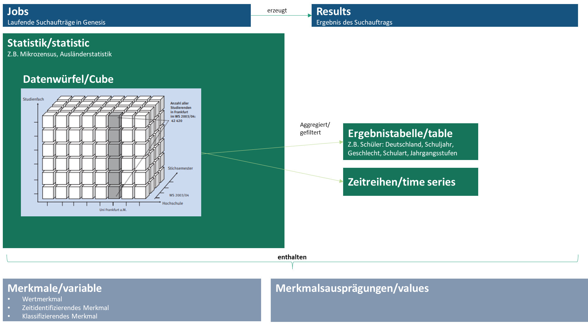

How to use
==========

The GENESIS data model
----------------------

The Genesis data structure consists of multiple elements as summarized in the image below.

This package currently supports retrieving the following data types:

- Cubes: Multi-dimensional data objects
- Tables: Derivatives of cubes that are already packaged into logical units

Find the right data
-------------------

``pystatis`` offers the `Find` class to search for any piece of information with GENESIS. Behind the scene it's using the `find` endpoint.

Example:

.. code-block:: python

    from pystatis import Find

    results = Find("Rohöl") # Initiates object that contains all variables, statistics, tables and cubes
    results.run() # Runs the query
    results.tables.df # Results for tables
    results.tables.get_code([1,2,3]) # Gets the table codes, e.g. for downloading the table
    results.tables.get_metadata([1,2]) # Gets the metadata for the table

A complete overview of all use cases is provided in the sample notebook for `find <https://github.com/CorrelAid/pystatis/blob/main/nb/find.ipynb>`_.

Download data
-------------

Data can be downloaded in to forms: as tables and as cubes. Both interfaces have been aligned to be as close as possible to each other.

Example for downloading a Table:

.. code-block:: python

    from pystatis import Table

    t = Table(name="21311-0001")  # data is not yet downloaded
    t.get_data()  # Only now the data is either fetched from GENESIS or loaded from cache. If the data is downloaded from online, it will be also cached, so next time the data is loaded from cache.
    t.data  # a pandas data frame

Example for downloading a Cube:

.. code-block:: python

    from pystatis import Cube

    c = Cube(name="22922KJ1141")  # data is not yet downloaded
    c.get_data()  # Only now the data is either fetched from GENESIS or loaded from cache. If the data is downloaded from online, it will be also cached, so next time the data is loaded from cache.
    c.data  # a pandas data frame

For more details, please study the provided sample notebook for `tables <https://github.com/CorrelAid/pystatis/blob/main/nb/table.ipynb>_` and `cubes <https://github.com/CorrelAid/pystatis/blob/main/nb/cube.ipynb>`_.

Clear Cache
-----------

When a cube or table is queried, it will be put into cache automatically. The cache can be cleared using the following function:

.. code-block:: python

    from pystatis import clear_cache

    clear_cache("21311-0001")  # only deletes the data for the object with the specified name
    clear_cache()  # deletes the complete cache
